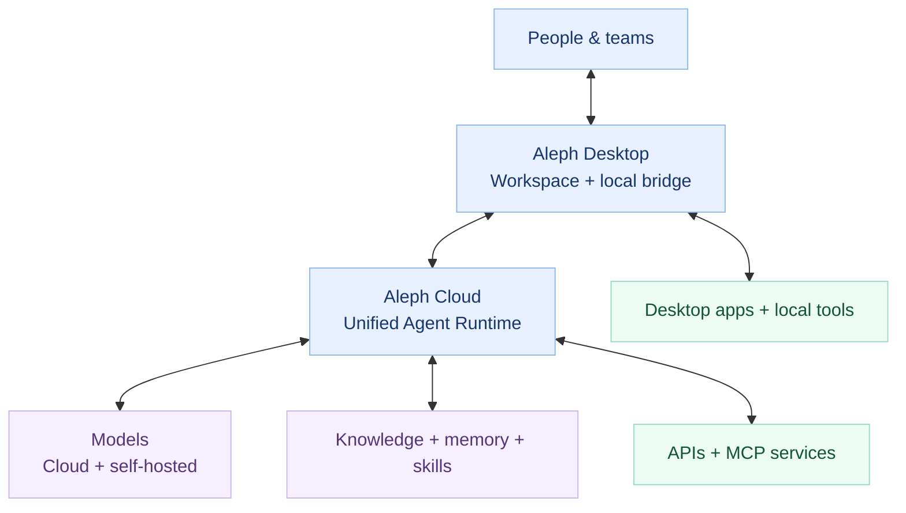

<!-- Aleph Technologies · Organization profile · github.com/alephhq-tech -->

  

### Hello, we're Aleph Technologies.

# AI that goes beyond the conversation.

**One workspace. Any model. Real work.**

We're building an AI-native platform where intelligent agents connect your ideas with the tools, knowledge, and applications needed to bring them to life.

 

<a href="https://alephhq.tech"><b>Explore Aleph ↗</b></a>
&nbsp;&nbsp;&nbsp;·&nbsp;&nbsp;&nbsp;
<a href="#the-aleph-ecosystem"><b>Meet the platform</b></a>
&nbsp;&nbsp;&nbsp;·&nbsp;&nbsp;&nbsp;
<a href="mailto:contact@alephhq.tech"><b>Get in touch ↗</b></a>

  

AGENTIC AI &nbsp; · &nbsp; DESKTOP + CLOUD &nbsp; · &nbsp; OPEN INTEGRATIONS

---

  <h2>Meet your new way of working ✨</h2>
  
Less switching between apps. More work getting done. Aleph brings context, intelligence, and execution into one connected experience.

<table>
  <tr>
    <td align="center" valign="top" width="33%">
       
      <h3>Aleph Desktop</h3>
      
<b>Your workspace.</b>

      
A native home for conversations, projects, files, agent activity, and tools on your computer.

      THE EXPERIENCE
    </td>
    <td align="center" valign="top" width="34%">
       
      <h3>Aleph Cloud</h3>
      
<b>Your intelligence.</b>

      
A unified cloud agent runtime for task orchestration, models, persistent context, knowledge, memory, and skills.

      THE ENGINE
    </td>
    <td align="center" valign="top" width="33%">
       
      <h3>Integrations</h3>
      
<b>Your connections.</b>

      
Bring APIs, MCP servers, desktop applications, and professional software into agent workflows.

      THE CONNECTIONS
    </td>
  </tr>
</table>

  
<strong>One platform. Connected by design.</strong>

 

## Built for tasks, not just prompts.

<table>
  <tr>
    <td width="35%" align="center" valign="middle">
      
    </td>
    <td valign="middle">
      <h3>It remembers what matters.</h3>
      
Great work starts with context. We're designing Aleph around persistent project knowledge, reusable skills, history, and memory—so every task can build on what came before.

      
<strong>Context is part of the workspace, not an afterthought.</strong>

    </td>
  </tr>
</table>

<table>
  <tr>
    <td width="50%" valign="top">
      <h3>🧠 Context-aware</h3>
      
Keep projects, files, knowledge, and memories connected across work sessions.

    </td>
    <td width="50%" valign="top">
      <h3>🔌 Tool-connected</h3>
      
Move beyond generating text to working with APIs, MCP, and native application bridges.

    </td>
  </tr>
  <tr>
    <td valign="top">
      <h3>🔀 Model-flexible</h3>
      
Choose cloud or self-hosted models according to the task, not a single provider's limits.

    </td>
    <td valign="top">
      <h3>🛡️ Human-controlled</h3>
      
Keep actions visible, approvals meaningful, and results easy to inspect.

    </td>
  </tr>
</table>

 

## Where imagination meets execution.

We are starting with workflows where agents need genuine project understanding and real tool access.

**⌨️ Software development** — Navigate codebases, assist with engineering tasks, and coordinate development tools.

**📐 Engineering & CAD** — Connect AI agents to professional drafting applications; AutoCAD is an early integration focus, not the boundary of the platform.

**🧩 Professional workflows** — Bring together documents, project knowledge, connected services, and repeatable multi-step tasks.

<strong>See how Aleph fits together →</strong>

 

High-level product architecture. Implementation and availability will evolve throughout development.

 

---

## From intent to execution.

We're building toward a future where AI is more than a chat window:
**a reliable collaborator that understands your work and helps you move it forward.**

 

**Curious about Aleph? Let's connect.**

<a href="https://alephhq.tech"><b>alephhq.tech ↗</b></a>
&nbsp;&nbsp;·&nbsp;&nbsp;
<a href="mailto:contact@alephhq.tech"><b>contact@alephhq.tech ↗</b></a>
&nbsp;&nbsp;·&nbsp;&nbsp;
<a href="https://github.com/alephhq-tech"><b>GitHub ↗</b></a>

  

Early-stage · Actively building · Some capabilities shown are in development.

  

© 2026 Aleph Technologies. Made for meaningful work.

