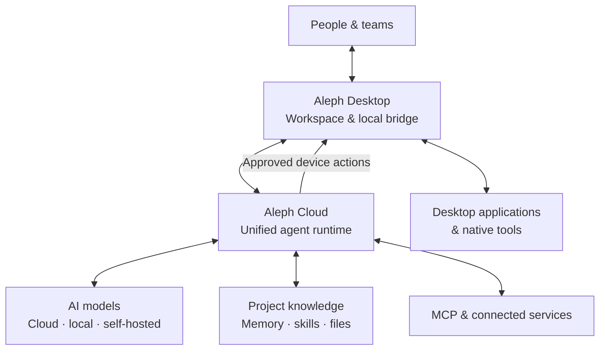

  

  <h1>Aleph Technologies</h1>
  
<strong>From intent to execution.</strong>

  

    Building an AI-native workspace where intelligent agents help people
    get real work done across tools, applications, and projects.
  

  

    <a href="https://alephhq.tech"><strong>Website</strong></a>
    &nbsp;·&nbsp;
    <a href="mailto:contact@alephhq.tech"><strong>Contact</strong></a>
    &nbsp;·&nbsp;
    <a href="#our-platform"><strong>Platform</strong></a>
    &nbsp;·&nbsp;
    <a href="#our-vision"><strong>Vision</strong></a>
  

---

## About Aleph

**Aleph Technologies** is building a unified platform that connects capable AI models with the tools, knowledge, and software people already use.

We believe the next generation of AI software should go beyond answering questions. It should be able to understand a project's context, plan meaningful work, interact with real applications, and help people review and complete tasks with confidence.

Our goal is to make **AI agents practical, extensible, and useful for professional work**—not another isolated chat interface.

## Our platform

Aleph is designed as one connected ecosystem, with a lightweight desktop experience and a cloud-powered agent runtime.

| Product | Purpose |
| :--- | :--- |
| **Aleph Desktop** | A native workspace for AI conversations, projects, files, agent activity, tool results, and desktop integrations. |
| **Aleph Cloud** | A centralized runtime for agent orchestration, model access, persistent workspaces, knowledge, memory, skills, and task execution. |
| **Aleph Integrations** | An extensible integration layer connecting agents with APIs, Model Context Protocol (MCP) servers, local bridges, and professional applications. |

> **Development status:** Aleph is an early-stage platform under active development. The descriptions above represent our product direction and evolving implementation—not a claim that every capability is already generally available.

## How Aleph is designed to work

The design keeps the user interface lightweight while allowing agents to access cloud-based context and capabilities. Where device access is required, a local bridge connects the workspace to applications under the user's control.

## What guides us

<table>
  <tr>
    <td width="50%" valign="top">
      <h3>🧠 Context that persists</h3>
      
Projects, knowledge, memory, and reusable skills should carry forward across sessions and workflows.

    </td>
    <td width="50%" valign="top">
      <h3>🔌 Tools, not just text</h3>
      
Agents should be able to work with real software through structured, extensible integrations.

    </td>
  </tr>
  <tr>
    <td valign="top">
      <h3>🔀 Model flexibility</h3>
      
Use the AI model that fits the task, including cloud and self-hosted options, without tying the workspace to a single provider.

    </td>
    <td valign="top">
      <h3>🛡️ Humans stay in control</h3>
      
Important actions need appropriate approval, clear feedback, and inspectable results.

    </td>
  </tr>
</table>

## Where we're starting

We are developing Aleph around complex workflows where context and direct application access matter:

- **Software development:** coding, debugging, reviewing changes, navigating projects, and technical documentation.
- **Engineering & CAD:** working with technical drawings and engineering software; AutoCAD is one of our initial integration targets.
- **Professional workflows:** linking files, knowledge, specialized tools, and repeatable multi-step processes.

**AutoCAD is a starting use case, not the boundary of the platform.** Our architecture is intended to support additional integrations and professional domains over time.

## Our vision

**A universal AI workspace for real work.**

An environment where people can express what they want to achieve, intelligent agents can combine context and tools to help accomplish it, and every important result remains understandable and controllable.

We are building toward a future in which AI works alongside professionals—not simply as a chat companion, but as a reliable collaborator.

## Connect with Aleph Technologies

We welcome conversations with developers, engineers, organizations, and potential partners interested in practical agent-powered software.

- 🌐 **Website:** [alephhq.tech](https://alephhq.tech)
- ✉️ **Business inquiries & partnerships:** [contact@alephhq.tech](mailto:contact@alephhq.tech)
- 💻 **GitHub:** [@alephhq-tech](https://github.com/alephhq-tech)

---

  © 2026 Aleph Technologies · Building AI that moves work forward.

