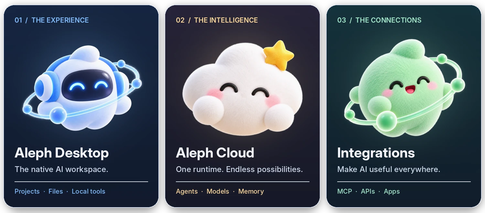
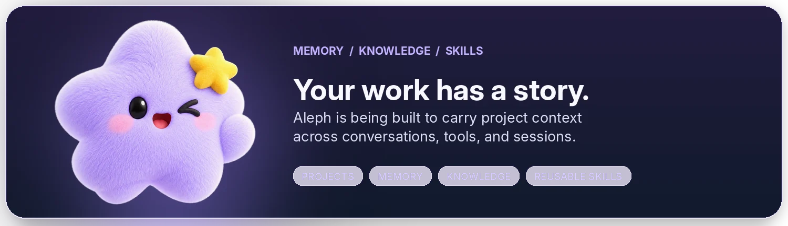
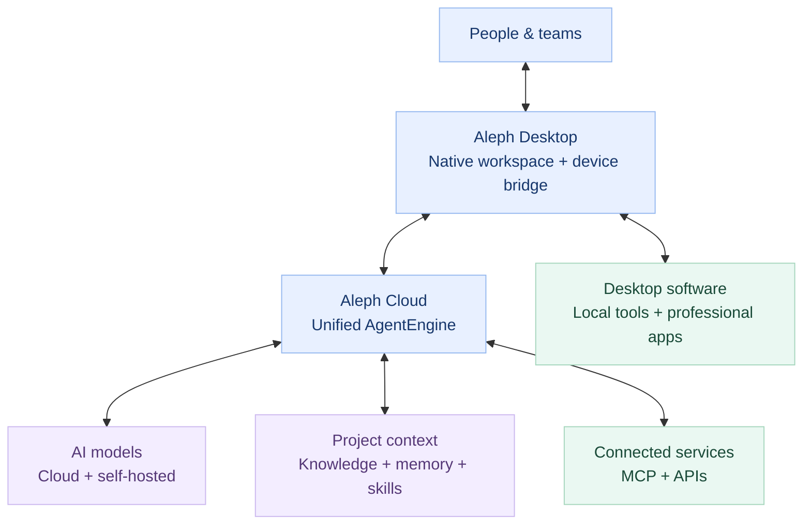

<!--
  Aleph Technologies · Official GitHub Organization profile
  The native banner is preserved. All product artwork uses plush mascots
  with genuine transparent backgrounds, composited into designed artwork.
  Profile source: alephhq-tech/.github/profile/README.md
-->

  

    
  INTRODUCING ALEPH TECHNOLOGIES

  <h1>Don't just chat with AI. Get things done.</h1>

  
<strong>One workspace. Any model. Real work.</strong>

  

    We're building an AI-native workspace that connects models to your projects,
    knowledge, and everyday tools—so agents can help turn an idea into an outcome.
  

  

    <a href="https://alephhq.tech"><strong>Explore Aleph ↗</strong></a>
    &nbsp;&nbsp; · &nbsp;&nbsp;
    <a href="#the-platform"><strong>Meet the platform ↓</strong></a>
    &nbsp;&nbsp; · &nbsp;&nbsp;
    <a href="mailto:contact@alephhq.tech"><strong>Talk to us ↗</strong></a>
  

 

## The platform

**Three connected parts. One seamless experience.** From the desktop where work begins, to the cloud where agents run, to the applications that make their actions useful.

  

 

## Built for continuity, not one-off prompts.

  

  
<strong>Model freedom &nbsp; · &nbsp; Real tool access &nbsp; · &nbsp; Persistent context &nbsp; · &nbsp; Human oversight</strong>

 

## Made for work that spans more than one app.

| Software & development | Engineering & design | Teams & operations |
| :-- | :-- | :-- |
| Move between code, documentation, repositories, and developer tools. | Connect agents to technical workflows and professional applications such as AutoCAD. | Bring files, organizational knowledge, and connected services into repeatable workflows. |

<strong>Explore the architecture ↗</strong>

 

Aleph is designed around **one cloud agent runtime**, a lightweight desktop client, and an extensible bridge to connected tools. Models can change without rebuilding the workspace.

Conceptual architecture. Capabilities and implementation will evolve during development.

 

---

  <h2>Let's build what's next.</h2>

  
We're here for developers, engineers, and teams who want AI to connect with real-world work.

  

    <a href="https://alephhq.tech"><strong>Visit alephhq.tech ↗</strong></a>
    &nbsp;&nbsp; · &nbsp;&nbsp;
    <a href="mailto:contact@alephhq.tech"><strong>Contact Aleph ↗</strong></a>
    &nbsp;&nbsp; · &nbsp;&nbsp;
    <a href="https://github.com/alephhq-tech?tab=repositories"><strong>Our GitHub ↗</strong></a>
  

  Early-stage · Actively building · Some capabilities described are still in development.

    
  © 2026 Aleph Technologies

