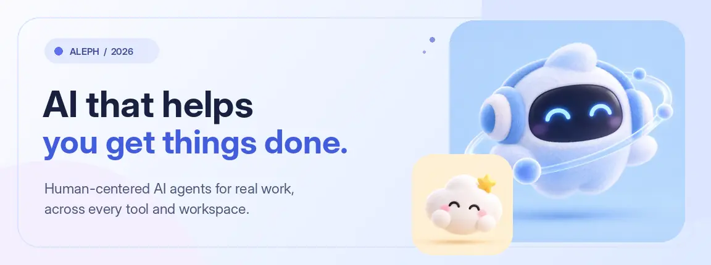

<!--
  Aleph Technologies — GitHub organization profile.
  This README is rendered at https://github.com/alephhq-tech.
  All illustrations are hosted in this repository under profile/assets/.
-->

<div align="center">
  <a href="https://alephhq.tech" title="Visit Aleph Technologies">
    
  </a>

  <h1>Hi, we're Aleph Technologies. </h1>

  <p>
    <strong>One workspace. Any model. Real work.</strong><br />
    We are building an AI-native platform where agents connect your ideas to the tools, files, and apps that bring them to life.
  </p>

  <p>
    <a href="https://alephhq.tech"><strong>Website ↗</strong></a>
    &nbsp;&nbsp;•&nbsp;&nbsp;
    <a href="mailto:contact@alephhq.tech"><strong>Get in touch ↗</strong></a>
    &nbsp;&nbsp;•&nbsp;&nbsp;
    <a href="https://github.com/alephhq-tech?tab=repositories"><strong>Explore GitHub ↗</strong></a>
  </p>
</div>

<br />

## ✨ Meet the Aleph platform

AI should do more than write the next response. We want it to **understand the task, use the right tools, and help finish the work**—while keeping people informed and in control.

<table>
  <tr>
    <td align="center" valign="top" width="33%">
      <br />
      <h3>Aleph Desktop</h3>
      <p>A lightweight native workspace for conversations, projects, files, agent activity, and connected desktop tools.</p>
      <sub>THE EXPERIENCE</sub>
    </td>
    <td align="center" valign="top" width="33%">
      <br />
      <h3>Aleph Cloud</h3>
      <p>Our shared agent runtime for orchestrating tasks, accessing models, and managing project knowledge, memory, and skills.</p>
      <sub>THE INTELLIGENCE</sub>
    </td>
    <td align="center" valign="top" width="33%">
      <br />
      <h3>Integrations</h3>
      <p>Connect agents to APIs, MCP servers, native applications, and the real-world tools professionals rely on.</p>
      <sub>THE CONNECTIONS</sub>
    </td>
  </tr>
</table>

<div align="center">
  <p><strong>Desktop + Cloud + Connected Tools = One Aleph experience.</strong></p>
</div>

## 🪄 A little magic, built on real engineering

<table>
  <tr>
    <td width="27%" align="center" valign="middle">
      
    </td>
    <td valign="middle">
      <h3>Know the project. Remember the context.</h3>
      <p>Every useful agent needs more than a prompt. Aleph is being designed around persistent workspaces, searchable project knowledge, reusable skills, and memory that can support work across sessions.</p>
    </td>
  </tr>
</table>

Four ideas guide what we're building:

- **🔀 Model flexibility** — Choose the intelligence that fits the task, including cloud and self-hosted models; Aleph should not depend on one provider.
- **🔌 Tools that actually connect** — Use MCP, APIs, and local bridges to work inside professional software instead of stopping at text output.
- **🧩 One coherent agent runtime** — Keep orchestration, context, tools, and execution consistent across integrations.
- **🛡️ Human control** — Make important actions reviewable, permissions explicit, and results easy to inspect.

<details>
  <summary><strong>See the platform architecture</strong></summary>
  <br />

  ```mermaid
  flowchart TB
      U["People & teams"] <--> D["Aleph Desktop<br/>Native workspace + local bridge"]
      D <--> C["Aleph Cloud<br/>Unified agent runtime"]
      C <--> M["AI models<br/>Cloud + self-hosted"]
      C <--> K["Project context<br/>Memory + knowledge + skills"]
      C <--> T["Connected tools<br/>MCP + APIs"]
      D <--> A["Desktop applications<br/>Local tools + native integrations"]
      classDef blue fill:#e7efff,color:#1b3365,stroke:#9bb7f2,stroke-width:1.5px;
      classDef lavender fill:#f2eaff,color:#4d3672,stroke:#cdb6f1,stroke-width:1.5px;
      classDef mint fill:#e9f7ef,color:#245647,stroke:#aad9c0,stroke-width:1.5px;
      class U,D,C blue;
      class M,K lavender;
      class T,A mint;
  ```

  <p><sub>This diagram illustrates our architectural direction; implementation details will evolve as the platform matures.</sub></p>
</details>

## 🌱 Where we're starting

We are beginning with workflows where AI can be especially helpful when it has direct access to context and specialized tools:

**Software engineering** — coding, debugging, navigating repositories, and technical documentation.

**Engineering and CAD** — understanding technical information and working with professional drafting tools; AutoCAD is an early integration focus, not the limit of the platform.

**Professional workflows** — combining project files, organizational knowledge, connected services, and repeatable multi-step tasks.

> **Currently building:** Aleph is an early-stage platform. Some capabilities on this page describe our product direction and are not yet generally available.

## 💌 Let's make something useful

We're interested in collaborating with developers, engineers, and teams exploring practical AI agents.

<div align="center">
  <p><strong>Building AI that moves work forward, one meaningful task at a time.</strong></p>
  <p>
    <a href="https://alephhq.tech">alephhq.tech</a>
    &nbsp;•&nbsp;
    <a href="mailto:contact@alephhq.tech">contact@alephhq.tech</a>
    &nbsp;•&nbsp;
    <a href="https://github.com/alephhq-tech">GitHub @alephhq-tech</a>
  </p>
  <sub>© 2026 Aleph Technologies · From intent to execution.</sub>
</div>